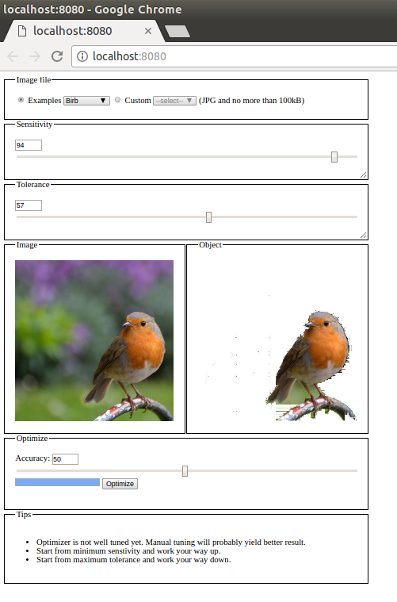

A simple web console application for the [**object-detection**](https://github.com/rosesonfire/objectDetection) package<br /><br />
NPM Link: [object-detection-console](https://www.npmjs.com/package/object-detection-console)
# Installation
`npm i object-detection-console --save-dev`
# Usage
In package.json:
```
{
  "scripts": {
    "console": "object-detection-console <custom-image-dir>" // custom-image-dir is the local directory with the images (non-jpg images or images above 100kB will not show up)
  }
}
```
Then run:
```
npm run console
```


# Caution
- Use small images, preferably in JPG format and less than 100 kB.
- Currently works for single object.
- Behaviour is not strongly defined for multi-objects.
- Contiguous objects are considered as single object.
- Optimizer is not well tuned yet.